# Venator Exploit Graph Report

**Target:** https://anduril.com
**Generated:** 2026-05-14 05:22:47 UTC
**Risk Score:** 0 | **Composite:** 0.0

## Attack Narrative

No confirmed attack transitions yet. The attacker remains at the initial position across all dimensions.

## Attacker Position

| Dimension | Current State | Risk |
| --- | --- | ---: |
| Asset | External / Unknown | 0/100 |
| Auth | Unauthenticated | 0/100 |
| Privilege | No Privilege | 0/100 |
| Data Access | Public Data Only | 0/100 |
| Cloud | No Cloud Access | 0/100 |

## Critical Attack Paths

- **Authenticated User Session** (auth): 1 hops, probability 33.00%
- **Source Code Access** (data_access): 1 hops, probability 13.00%
- **Database Dump** (data_access): 1 hops, probability 13.00%
- **SSO / Federated Auth** (auth): 1 hops, probability 8.00%
- **Admin Access** (privilege): 2 hops, probability 6.59%
- **Internal Network Access** (asset): 3 hops, probability 1.45%
- **Super Admin** (privilege): 3 hops, probability 0.00%
- **Full Cloud Admin** (cloud): 3 hops, probability 0.00%

## Suggested Next Tests

| # | Test | Expected Value | Chain |
| ---: | --- | ---: | --- |
| 1 | Secrets Leak in Source | 32.0 | supply_chain/secrets-repo |
| 2 | Authenticated → Standard User | 27.0 | — |
| 3 | Public Bucket Access | 22.8 | cloud/bucket-exposure |
| 4 | Weak Password Reset | 21.0 | auth/password-reset |
| 5 | Secrets Leak → API Key | 17.5 | supply_chain/secrets-repo |
| 6 | SSH/DB Exposure | 17.5 | cloud/ssh-db-exposure |
| 7 | Subdomain Enumeration | 16.0 | infra/full-recon |
| 8 | SQL Injection → DB Dump | 15.0 | web/sql-injection |
| 9 | Port & Service Scan | 14.0 | infra/port-service-enum |
| 10 | DNS Takeover | 14.0 | cloud/dns-misconfig |

## Available Chains

- `infra/full-recon` — Subdomain Enumeration (p=80%)
- `auth/account-enumeration` — Account Enumeration (p=80%)
- `infra/port-service-enum` — Port & Service Scan (p=70%)
- `auth/password-reset` — Weak Password Reset (p=35%)
- `supply_chain/secrets-repo` — Secrets Leak → API Key (p=35%)
- `cloud/bucket-exposure` — Public Bucket Access (p=35%)
- `auth/session-fixation` — Session Fixation (p=25%)
- `cloud/ssh-db-exposure` — SSH/DB Exposure (p=25%)
- `auth/oauth-misconfig` — OAuth Redirect Bypass (p=20%)
- `web/xss-reflected` — XSS → Session Steal (p=20%)

## Graph Visualization

```mermaid
stateDiagram-v2
    external_unknown : External / Unknown
    state external_unknown <<current>>
    state external_unknown <<initial>>
    subdomain_enumerated : Subdomains Enumerated
    cloud_resource_access : Cloud Resource Access
    unauthenticated : Unauthenticated
    state unauthenticated <<current>>
    state unauthenticated <<initial>>
    session_token_obtained : Session Token Obtained
    user_session : Authenticated User Session
    state user_session <<goal>>
    api_key_obtained : API Key Obtained
    sso_federated : SSO / Federated Auth
    state sso_federated <<goal>>
    no_privilege : No Privilege
    state no_privilege <<current>>
    state no_privilege <<initial>>
    standard_user : Standard User
    public_data_only : Public Data Only
    state public_data_only <<current>>
    state public_data_only <<initial>>
    own_user_data : Own User Data
    sensitive_pii : Sensitive PII
    database_dump : Database Dump
    state database_dump <<goal>>
    source_code_access : Source Code Access
    state source_code_access <<goal>>
    no_cloud_access : No Cloud Access
    state no_cloud_access <<current>>
    state no_cloud_access <<initial>>
    metadata_accessible : Cloud Metadata Accessible
    storage_bucket_access : Storage Bucket Access
    [*] --> external_unknown
    [*] --> unauthenticated
    [*] --> no_privilege
    [*] --> public_data_only
    [*] --> no_cloud_access
    external_unknown --> subdomain_enumerated : Subdomain Enumeration (80%)
    external_unknown --> subdomain_enumerated : Port & Service Scan (70%)
    unauthenticated --> user_session : Weak Password Reset (35%)
    unauthenticated --> session_token_obtained : Session Fixation (25%)
    unauthenticated --> user_session : OAuth Redirect Bypass (20%)
    unauthenticated --> user_session : OAuth Deep Exploitation (15%)
    unauthenticated --> user_session : SAML Assertion Manipulation (15%)
    unauthenticated --> session_token_obtained : XSS → Session Steal (20%)
    unauthenticated --> session_token_obtained : Blind XSS → Session Steal (OOB) (15%)
    unauthenticated --> unauthenticated : Account Enumeration (80%)
    unauthenticated --> user_session : GraphQL Auth Bypass (10%)
    unauthenticated --> api_key_obtained : Secrets Leak → API Key (35%)
    unauthenticated --> sso_federated : SAML → SSO Federated (10%)
    no_privilege --> standard_user : Authenticated → Standard User (90%)
    public_data_only --> database_dump : SQL Injection → DB Dump (15%)
    public_data_only --> sensitive_pii : Blind SQLi → Sensitive Data (10%)
    public_data_only --> source_code_access : Path Traversal → Source Code (15%)
    public_data_only --> source_code_access : XXE → File Read (10%)
    public_data_only --> source_code_access : SSTI → File Read / RCE (12%)
    public_data_only --> sensitive_pii : Secrets Leak in Source (40%)
    public_data_only --> own_user_data : Open Redirect → Phishing (20%)
    no_cloud_access --> metadata_accessible : SSRF → Cloud Metadata (20%)
    no_cloud_access --> storage_bucket_access : Public Bucket Access (35%)
    no_cloud_access --> cloud_resource_access : Kubernetes API Exposed (15%)
    no_cloud_access --> cloud_resource_access : DNS Takeover (20%)
    no_cloud_access --> cloud_resource_access : SSH/DB Exposure (25%)
    user_session --> [*]
    sso_federated --> [*]
    database_dump --> [*]
    source_code_access --> [*]

    note right of external_unknown
        Risk Score: 0
        Composite: 0.0
    end note
```

---
*Generated by Venator Exploit Graph Engine*